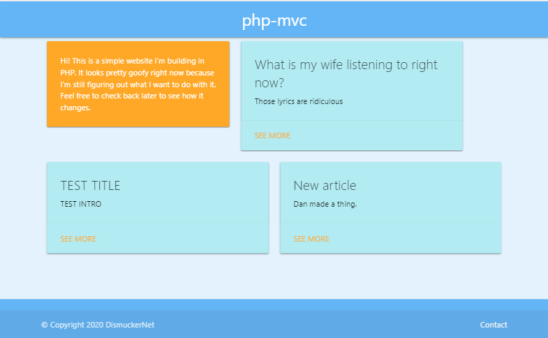

# php-mvc

# Description

_This project is under construction._

I wanted a meaty PHP project to provide a bit of a break from the node projects I'd been working on. I found [this](https://isitoktocode.com/post/create-a-simple-php-mvc-framework?cookieChange) tutorial for building a news app in PHP following the Model-View-Controller paradigm and thought it looked like fun. I started with that and added Materialize CSS then started to build out my own models and controllers. The goal is to build a fully functional blog template with authentication and a WSIWYG editor.

This is kind of a free form exercise so it should change a lot over time. Check out my progress at https://php-mvc-gfh.herokuapp.com/.

# Dependencies

You need an Apache web server and a local MySQL server.

Uncomment this line in httpd.conf to allow URL rewrites:

<pre>
LoadModule rewrite_module modules/mod_rewrite.so
</pre>

Configure .htaccess to accept a parameter called 'load':

<pre>
RewriteEngine On
RewriteCond %{REQUEST_FILENAME} !-f
RewriteCond %{REQUEST_FILENAME} !-d
RewriteRule ^(.\*)$ index.php?load=$1 [PT,L]
</pre>

Create a file called config.php in the root of the folder. Store your database credentials here. It should look like this:
<pre>
define ('DB_HOST', 'localhost');

define ('DB_NAME', 'your_dbname');

define ('DB_USER', 'your_username');

define ('DB_PASS', 'your_password');
</pre>

NOTE: The MySQL user must have write access to the database.

# Installation

Clone the repo in to the htdocs folder of your web server.

Run the seed.sql script to build the tables and populate a sample article.

Open a browser and browse to http://localhost to see the home page.

# How to use

For now, just click the links in the nav to access the pages. Click Add to save a new post to the database, which will add it to the home page.

# To Do

Add authentication

~~Text editor~~

Refine text editor (replace obsolete javascript, formatting for lists, etc.)

Image uploads

Styling

Multi-select categories

Filter articles by category
